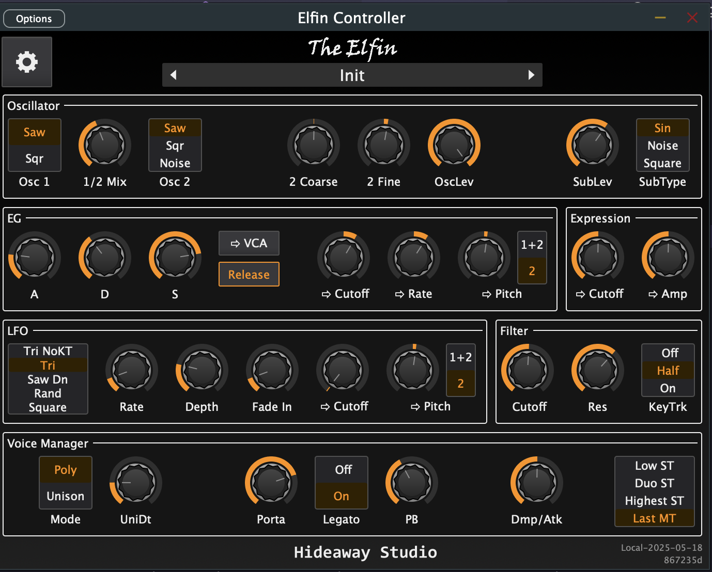

# Elfin Controller 



This software provides an editor/controller for the Elfin-04 and Elfin-01 hardware
synths from Hideaway Studios. It comes as both a standalone editor and as a CLAP/VST3/AU
plugin for use in your daw.

The code is currently a late stage beta and ready for users to start testing.

## Installing the Elfin Controller

In our current beta stage, we have a regular nightly build and versioned builds.
Those builds are available [here](https://github.com/baconpaul/elfin-controller/tags)

Grab either the Nightly or, if present, the most recent tagged build with a version.
It will contain a zip for windows and linux users and a dmg for macOS

### Windows


Unzip the zip file. Install the VST3 and/or CLAP in your appropriate plugin directory,
such as `c:\program files\common files\CLAP` or `\VST3`.

Move the exe to a location of your chosing. 

The binaries are fully self contained and require no other assets.

### macOS

The mac DMG contains a signed notarized installer. After opening the DMG
run the installer and follow the directions. You should see a plugin in 
all your DAWs. In the event the plugin doesn't appear in logic the first
time you install, open a terminal and type `sudo killall -9 AudioComponentRegistrar`.

### Linux

Unzip the zip file. Install the VST3 and/or CLAP in your appropriate plugin directory,
such as `~/.clap` or `/usr/lib/vst3`. Install the exe in an appropriate place.

The binaries are fully self contained and require no other assets.

## Know issues before 1.0

We are tracking a few final quality of life issues in the [github issue tracker](issues/) on this
repo.

## Building the Software

```bash
git clone https://github.com/baconpaul/elfin-controller
cd elfin-controller
git submodule update --init --recursive
cmake -Bignore/bld -DCMAKE_BUILD_TYPE=RELEASE
cmake --build ignore/bld --target elfin-controller-staged
```

Happy to talk about PRs and changes. Open an issue!

## Licensing

The source code in this repository is released under the MIT license, which can be found
[here](LICENSE.md). You can use this source in any context you wish. But since the final
assembled program has some components licensed under the Gnu General Public License 3 or later
[here](LICENSE-gpl3), the final assembled binary is released under that license. If you use
the source in a non-GPL3 complaint fashion, you must first remove those dependencies.

Source code is Copyright 2025, Paul Walker (baconpaul) and other authors as described in
the github transaction log.
